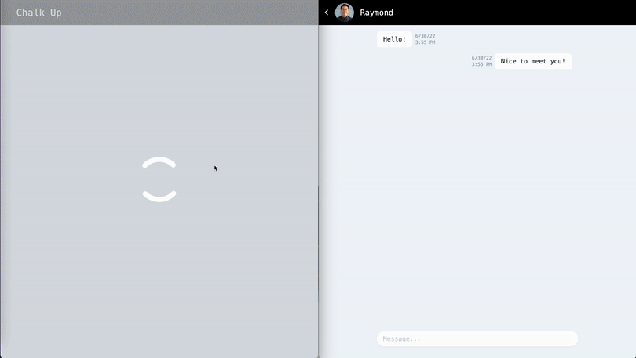

# Chalk Up

A web application for rock climbers who want to find others to climb with

When I first started out rock climbing, one of the hardest things was finding other people to rock climb with. This was especially applicable for top-roping and lead climbing, where another person is needed in order to climb. I remember having to reach out through facebook communities and instagram in order to potentially find people to climb with. I felt like it would be a nice quality of life change to create an app for like-minded rock climbers to meet each other without having to comb through multiple social media platforms.

[Link to deployment](https://chalk-up-app.herokuapp.com/)

Technologies:
-

React.js, PostgreSQL, Express.js, Node.js, Tailwind CSS, Socket.IO

Preview:
-


Features:
-
- User can log in to an account
- User can create a new account
- User can chat with other users in real time
- User can view messages in a chat
- User can send a message to another user
- User can view profiles of other users
- User can view a list of other user profiles

In progress:
-
- User can log out
- User can filter through other user profiles
- User can update details on their own profile
- User can view their own profile

Stretch Features:
-
- User can edit messages
- User can delete messages
- User can block other users

Requirements:
-
- Node.js version 18.2 or higher
- NPM version 8.9 or higher

Getting Started:
-
1. Clone the repository
2. Install all dependencies using NPM
```shell
npm -i
```
3. Make a copy of the .env file
```shell
cp .env.example .env
```
4. Start up PostgreSQL
```shell
sudo service postgresql start
```
5. Create a new database named chalkUp. The server can be viewed at http://localhost:8081
```shell
createdb chalkUp
```
6. Create a new amazon s3 bucket at Amazon Web Services(AWS), copy the access key, region, bucket name, and secret access key into the env file.
```
AWS_ACCESS_KEY_ID=
AWS_S3_BUCKET=
AWS_S3_REGION=
AWS_SECRET_ACCESS_KEY=
```
7. Start the project up in dev mode. The application can be viewed at http://localhost:3000
```shell
npm run dev
```
